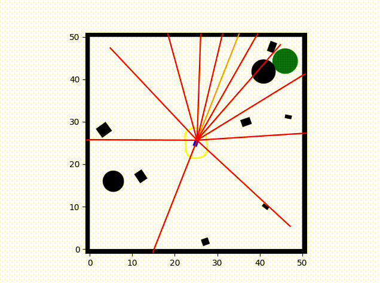
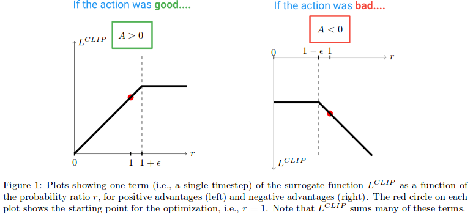

# Driving Reinforcement Learning #
This repo implements a basic driving environment and driving agent trained using reinforcement learning.

## Driving Environment ##
The environment has three kinds of bodies: the car, obstacles, and the goal. When the car touches an obstacle, the agent receives a negative penalty. When the car touches the goal, the agent receives a positive reward. The gamma parameter controls how much the agent should care about future rewards relative to immediate rewards.  All three objects are placed randomly within the scene and an obstacle border is placed around the scene to prevent the vehicle from going out of bounds.

## Observations ##
The agent observes the following dictionary of values at each time step:
| Observation | Significance | Format |
| ----------- | ------------ | ------ |
| Car Velocity | Speed of car in X and Y axes | (velocity_x, velocity_y) |
| Car Angle | Angle which car is facing | (cos(theta), sin(theta)) |
| Car Angle Velocity | Speed at which car angle is changing | (theta, ) |
| Car Visual | Distance from car to obstacle along each visual ray | (dist0, dist1, ...) |
| Goal Angle | Angle between car angle and goal | (cos(theta), sin(theta)) |
| Goal Distance | Distance from car to goal | (distance, ) |

## Driving Agent ##
The agent was trained using proximal policy optimization, which computes the advantage of a given policy against baselines rewards in order to compute a gradient with which to train the policy network. Given that the agent performs actions in a continuous action space, deep deterministic policy gradient (DDPG) was also evaluated but found to be less sample efficient than PPO. 

At each time step the agent infers the following actions:
| Observation | Significance | Format |
| ----------- | ------------ | ------ |
| Forward Acceleration | Change in car velocity in the forward direction, can be negative | (acceleration, ) |
| Angular Acceleration | Change in car angle relative to current angle | (angle_acceleration, ) |

## Lessons learned ##
During the experimentation with the car demo environment, the PPO reinforcement learning agent was trained to navigate towards the goal while avoiding obstacles. However, an unexpected behavior was observed when the trained agent consistently spun in circles instead of moving directly towards the target.

Upon investigation, it was discovered that the issue arose due to two factors: 1) there was very little tire friction in the system and 2) the agent was only capable of perceiving velocity in the forward direction. Because there was limited friction, the car's velocity at any given time step in any direction was essentially unbounded and because the agent could only perceive velocity in one direction, this meant the agent was incapable of knowing whether it was about to crash into an object that was orthogonal to it.

This led to the suboptimal strategy of spinning in circles to perceive velocity from all directions before potentially colliding with an obstacle. This issue was immediately resolved by providing the agent model with global velocity measurements, which enabled it to move directly towards the target without increasing the agent's risk of colliding with nearby obstacles. 

This experience highlights the surprising intelligence of reinforcement learning agents to adapt to small flaws in the environment, even if those flaws are not immediately apparent to the designer.
